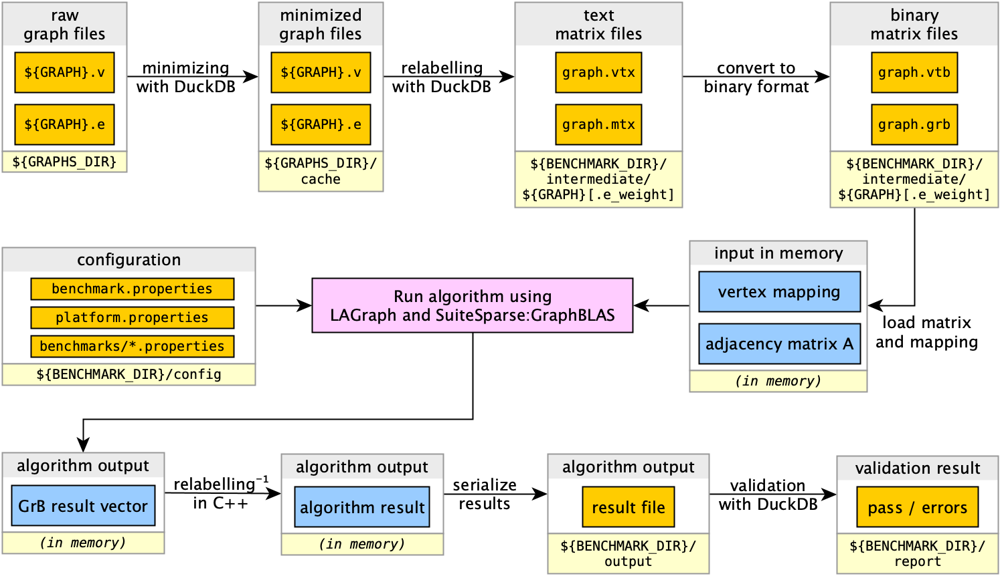

# SuiteSparse:GraphBLAS driver for LDBC Graphalytics

[](https://app.circleci.com/pipelines/github/ldbc/ldbc_graphalytics_platforms_graphblas)

Platform driver for the [LDBC Graphalytics benchmark](https://graphalytics.org) using [SuiteSparse:GraphBLAS](https://github.com/DrTimothyAldenDavis/GraphBLAS) and [LAGraph](https://github.com/GraphBLAS/LAGraph).

To execute the Graphalytics benchmark on GraphBLAS, follow the steps in the Graphalytics tutorial on [Running Benchmark](https://github.com/ldbc/ldbc_graphalytics/wiki/Manual%3A-Running-Benchmark) with the GraphBLAS-specific instructions listed below.

### Project structure

This project implements the GraphBLAS platform driver for the LDBC Graphalytics benchmark. It consists of the following components:

* The platform driver is written in Java and implements the classes required by the [`ldbc_graphalytics` framework](https://github.com/ldbc/ldbc_graphalytics).
* The algorithms (BFS, PR, etc.) are implemented in C in the [LAGraph library](https://github.com/GraphBLAS/LAGraph) (currently on the `dev` branch).
* The C++ wrapper for LAGraph is defined in the [`src/main/c` directory](https://github.com/ldbc/ldbc_graphalytics_platforms_graphblas/tree/main/src/main/c).
* The Java driver uses shell scripts to run the benchmark, see e.g. the [`execute-job.sh`](https://github.com/ldbc/ldbc_graphalytics_platforms_graphblas/blob/main/bin/sh/execute-job.sh) script that invokes the binary program for a given algorithm.
* The graphs (stored in `.v` and `.e` files) are converted to a vertex relabelling file (`.vtx`) and a matrix stored in Matrix Market format (`.mtx`). The vertex relabelling is a bijective mapping that maps between the sparse UINT64 IDs in the original data to a dense contiguous set of IDs between 1 and |V|. The mapping is implemented in the [`relabel.py` Python script](https://github.com/ldbc/ldbc_graphalytics_platforms_graphblas/blob/main/bin/py/relabel.py) that internally uses [DuckDB](https://duckdb.org/).

### Dependencies

On Debian/Fedora-based Linux distributions, you may install the prerequisite packages and dependencies listed below using a singe comman:

```
bin/sh/install-dependencies.sh
```

#### Prerequisite packages

Make sure you have the following software packages installed:

* Apache Maven 3+
* CMake 3.10+
* C++ compiler: GCC, Clang, or ICC
* Python 3.8+
* DuckDB Python package (`duckdb`)

On Linux, you may use the following script to install these dependencies:

```bash
bin/sh/install-prerequisites.sh
```

### SuiteSparse:GraphBLAS and LAGraph libraries

The implementation depends on two C libraries, SuiteSparse:GraphBLAS and LAGraph. We require very recent versions of these libraries, so it is best to compile them from their source code.

1. To install [SuiteSparse:GraphBLAS v7.4.0+](https://github.com/DrTimothyAldenDavis/GraphBLAS), run:

    ```bash
    bin/sh/install-graphblas.sh
    ```

1. To install [LAGraph](https://github.com/GraphBLAS/LAGraph) (`dev` branch), run:

    ```bash
    bin/sh/install-lagraph.sh
    ```

### Building only the C++ wrapper

To only build the C++ wrapper (for quick test builds), run the following script:

```bash
bin/sh/build-wrapper-only.sh
```

### Running the benchmark

1. To initialize the benchmark package, run:

    ```bash
    ./init.sh ${GRAPHS_DIR} ${MATRICES_DIR}
    ```

    where

    * `GRAPHS_DIR` is the directory of the graphs and the validation data. The argument is optional and its default value is `~/graphs`.
    * `MATRICES_DIR` is the directory of the pre-generated matrix files (in Matrix Market format). The argument is optional and its default value is `~/matrices`.

    This script creates a Maven package (`graphalytics-${GRAPHALYTICS_VERSION}-graphblas-${PROJECT_VERSION}.tar.gz`). Then, it decopresses the package, initializes a configuration directory `config` (based on the content of the `config-template` directory) and sets default values of the directories (see above) and the number of threads.

2. Navigate to the directory created by the `init.sh` script:

    ```bash
    cd graphalytics-*-graphblas-*/
    ```

3. Edit the configuration files (e.g. graphs to be included in the benchmark) in the `config` directory. Also, inspect `config/platform.properties` and check whether the value of `platform.graphblas.num-threads` was set correctly.

4. Run the benchmark with the following command:

    ```bash
    bin/sh/run-benchmark.sh
    ```

### Workflow

The workflow of the GraphBLAS implementation is illustrated in the following figure. Note that the "raw graph files" and the "configuration" are provided by the user, while the rest of the data artifacts (intermediate data sets, outputs, etc.) are created automatically by the framework.


